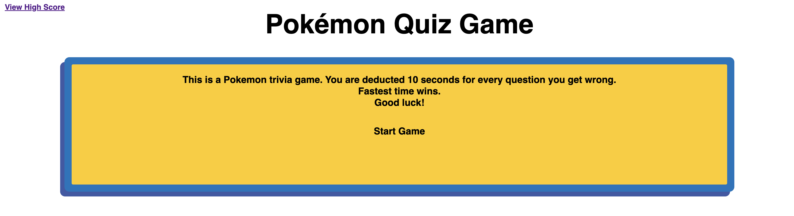
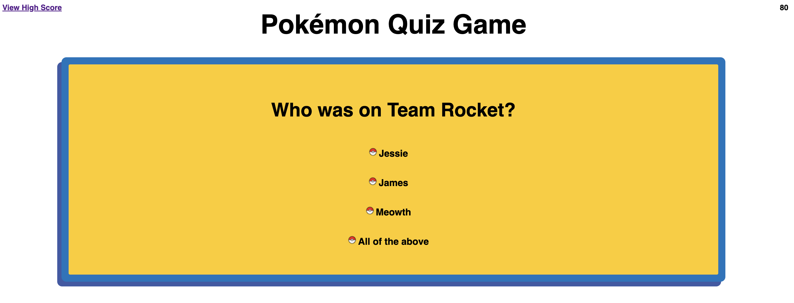
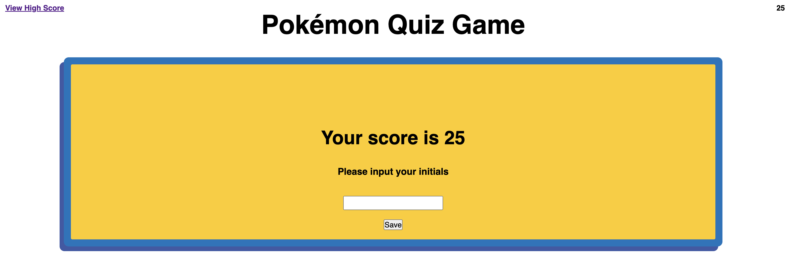
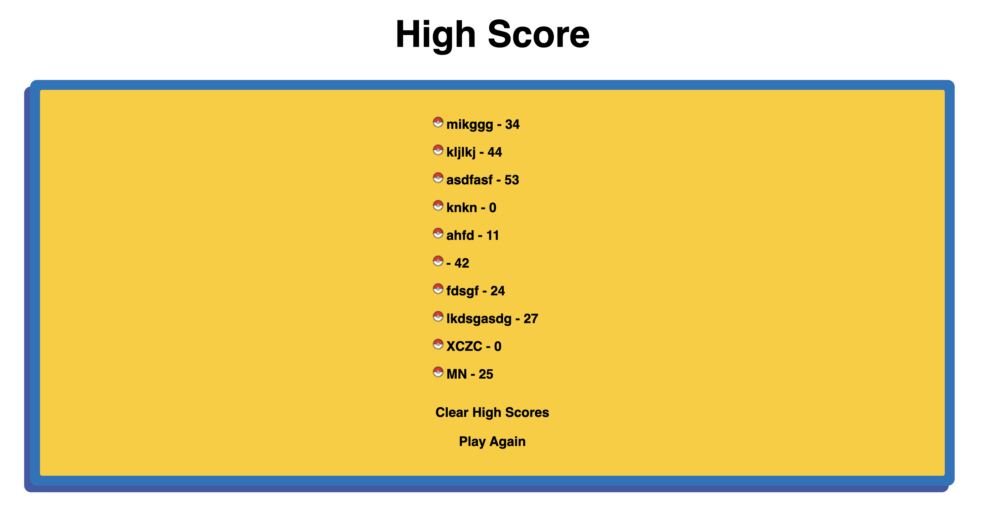

# Pokemon Quiz Game

## Description
    This project was made to get familiarize with web APIs, traversing the DOM, and more exposer to JavaScript. It was just a fun little Pokemon trivia game that made understand local storage, add html and css elements using JS, and much more JS methods to learn. 

## Installations
    No installation necessary, use the following URL to get to the game. 
    https://mikenguyen1092.github.io/04_Code_Quiz/

## Usage
    1. Open the index.html file in an internet browser. Click start game.

    2. Answer the questions by moving your mouse over the correct answer. 

    3. You're given a score when either the timer runs out or all the questions are answered. You then input your initials to save your score. 

    4. You can view your high score anytime by clicking the top left link. Once you are on the high score page, you can either play again or clear high scores.

## Credits
    Michael Nguyen

    EdX AI chat

## License
    MIT License

    Copyright (c) [2023] [Michael Nguyen]

    Permission is hereby granted, free of charge, to any person obtaining a copy of this software and associated documentation files (the "Software"), to deal in the Software without restriction, including without limitation the rights to use, copy, modify, merge, publish, distribute, sublicense, and/or sell copies of the Software, and to permit persons to whom the Software is furnished to do so, subject to the following conditions:

    The above copyright notice and this permission notice shall be included in all  copies or substantial portions of the Software.

    THE SOFTWARE IS PROVIDED "AS IS", WITHOUT WARRANTY OF ANY KIND, EXPRESS OR IMPLIED, INCLUDING BUT NOT LIMITED TO THE WARRANTIES OF MERCHANTABILITY, FITNESS FOR A PARTICULAR PURPOSE AND NONINFRINGEMENT. IN NO EVENT SHALL THE AUTHORS OR COPYRIGHT HOLDERS BE LIABLE FOR ANY CLAIM, DAMAGES OR OTHER LIABILITY, WHETHER IN AN ACTION OF CONTRACT, TORT OR OTHERWISE, ARISING FROM, OUT OF OR IN CONNECTION WITH THE SOFTWARE OR THE USE OR OTHER DEALINGS IN THE SOFTWARE.